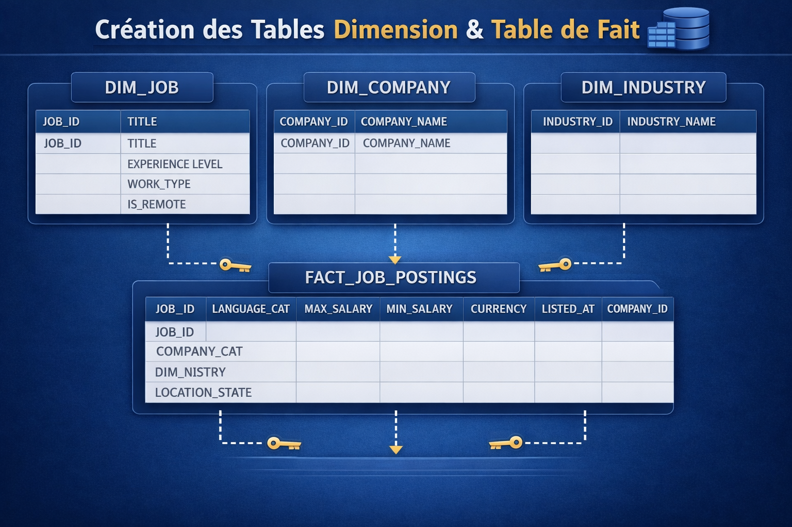

# 📊 Analyse des Offres d'Emploi LinkedIn avec Snowflake & Streamlit 

## 📝 Présentation du Projet
Dans un marché de l'emploi dynamique, l'analyse des données de plateformes comme **LinkedIn** est cruciale pour comprendre les tendances de recrutement. Ce projet met en place un pipeline de données complet, de l'ingestion de données brutes (CSV/JSON) à la visualisation interactive.

L'objectif est de transformer des milliers de lignes de données non traitées en **insights exploitables** pour identifier les secteurs porteurs et les structures de rémunération.

## 🏗️ Architecture Technique : Le Modèle Medallion

On a implémenté une architecture **Medallion** pour garantir la qualité et la traçabilité des données :

1.  **Bronze (Raw) :** Ingestion des données brutes depuis un stockage S3 vers Snowflake.
2.  **Silver (Cleaned) :** Nettoyage, dédoublonnage et typage des données.
3.  **Gold (Curated) :** Création de vues agrégées pour l'analyse métier.

---

# 🥉 Phase 1 : Ingestion des Données (Couche BRONZE)

La couche **Bronze** sert de zone d'atterrissage. L'objectif est de charger les fichiers sources sans transformation pour conserver une "source de vérité".

## 1. Configuration de l'Environnement & Stage
Nous créons d'abord la structure de la base de données et un `STAGE` externe pointant vers le bucket S3 contenant les données.

```sql
-- Création de la base de données et du schéma Bronze
CREATE DATABASE IF NOT EXISTS LINKEDIN;
CREATE SCHEMA IF NOT EXISTS LINKEDIN.BRONZE;

-- Configuration du Stage pour accéder aux fichiers S3
CREATE OR REPLACE STAGE LINKEDIN.BRONZE.linkedin_stage
URL = 's3://snowflake-lab-bucket/';
```

## 2. Ingestion des Données Structurées (CSV)

Pour les fichiers au format CSV (Job Postings, Benefits, Employee Counts, Skills), nous avons créé des tables typées `STRING` en couche Bronze. Cela permet d'éviter les erreurs de rejet lors du chargement si certains formats de date ou de nombres sont incohérents.

```sql
-- creation de la table Jobs_posting
CREATE TABLE IF NOT EXISTS LINKEDIN.BRONZE.JOB_POSTINGS
(
    job_id STRING,
    company_name STRING,
    title STRING,
    description STRING,
    max_salary STRING,
    med_salary STRING,
    min_salary STRING,
    pay_period STRING,
    formatted_work_type STRING,
    location STRING,
    applies STRING,
    original_listed_time STRING,
    remote_allowed STRING,
    views STRING,
    job_posting_url STRING,
    application_url STRING,
    application_type STRING,
    expiry STRING,
    closed_time STRING,
    formatted_experience_level STRING,
    skills_desc STRING,
    listed_time STRING,
    posting_domain STRING,
    sponsored STRING,
    work_type STRING,
    currency STRING,
    compensation_type STRING
);

-- charger les donnee dans la table
COPY INTO LINKEDIN.BRONZE.JOBS_POSTING
FROM @LINKEDIN_STAGE/job_postings.csv 
FILE_FORMAT = (TYPE = 'CSV' SKIP_HEADER = 1 FIELD_OPTIONALLY_ENCLOSED_BY = '"');

-- affichage
select * from LINKEDIN.BRONZE.JOB_POSTINGS;

     --**********--

-- creation de la table benefits
CREATE TABLE IF NOT EXISTS LINKEDIN.BRONZE.benefits (
    job_id string,    
    inferred string,          
    type string        
  );

-- charger les donnee dans la table
COPY INTO LINKEDIN.BRONZE.benefits
FROM @LINKEDIN_STAGE/benefits.csv 
FILE_FORMAT = (TYPE = 'CSV' SKIP_HEADER = 1 FIELD_OPTIONALLY_ENCLOSED_BY = '"');

--affichage
select * from LINKEDIN.BRONZE.benefits;

     --**********--

-- creation de la table employee_counts
CREATE TABLE IF NOT EXISTS LINKEDIN.BRONZE.employee_counts (
    company_id string,        
    employee_count string,               
    follower_count string,               
    time_recorded string        
  );

-- charger les donnee dans la table
COPY INTO LINKEDIN.BRONZE.employee_counts
FROM @LINKEDIN_STAGE/employee_counts.csv 
FILE_FORMAT = (TYPE = 'CSV' SKIP_HEADER = 1 FIELD_OPTIONALLY_ENCLOSED_BY = '"');

-- affichage
select * from LINKEDIN.BRONZE.employee_counts;

     --**********--

-- creation de la table employee_counts
CREATE TABLE IF NOT EXISTS LINKEDIN.BRONZE.job_skills(
    job_id  string ,       
    skill_abr string        
  );

-- charger les donnee dans la table
COPY INTO LINKEDIN.BRONZE.job_skills
FROM @LINKEDIN_STAGE/job_skills.csv 
FILE_FORMAT = (TYPE = 'CSV' SKIP_HEADER = 1 FIELD_OPTIONALLY_ENCLOSED_BY = '"');

-- affichage
select * from LINKEDIN.BRONZE.job_skills;
```

* **Note technique :** L'utilisation de `FIELD_OPTIONALLY_ENCLOSED_BY = '"'` est essentielle ici car les descriptions d'emploi sur LinkedIn contiennent souvent des virgules qui pourraient fausser la délimitation des colonnes.
  
## 3. Ingestion des Données Semi-Structurées (JSON)

Pour les fichiers complexes comme `Companies` ou `Industries`, nous avons utilisé le type de données `VARIANT` de Snowflake. C'est un choix stratégique qui permet :
* D'ingérer les fichiers sans définir de schéma à l'avance.
* De conserver l'intégralité des objets JSON pour un parsing ultérieur en couche Silver.

```sql
-- creation de la table Companies 
CREATE TABLE IF NOT EXISTS LINKEDIN.BRONZE.companies (
 data VARIANT                  
);

-- charger les donnee dans la tabl
COPY INTO LINKEDIN.BRONZE.Companies
FROM @LINKEDIN_STAGE/companies.json 
FILE_FORMAT = (TYPE = 'JSON');

-- affichage
select * from LINKEDIN.BRONZE.companies;

     --**********--

-- creation de la table job_industries 
CREATE TABLE IF NOT EXISTS LINKEDIN.BRONZE.job_industries (
 data VARIANT                  
);

-- charger les donnee dans la tabl
COPY INTO LINKEDIN.BRONZE.job_industries
FROM @LINKEDIN_STAGE/job_industries.json
FILE_FORMAT = (TYPE = 'JSON');

-- affichage
select * from LINKEDIN.BRONZE.job_industries;

     --**********--

-- creation de la table LINKEDIN.BRONZE.company_specialities 
CREATE TABLE IF NOT EXISTS company_specialities (
 data VARIANT                  
);

-- charger les donnee dans la tabl
COPY INTO LINKEDIN.BRONZE.company_specialities
FROM @LINKEDIN_STAGE/company_specialities.json
FILE_FORMAT = (TYPE = 'JSON');

-- affichage
select * from LINKEDIN.BRONZE.company_specialities;

     --**********--

-- creation de la table company_industries 
CREATE TABLE IF NOT EXISTS LINKEDIN.BRONZE.company_industries (
 data VARIANT                  
);

-- charger les donnee dans la tabl
COPY INTO LINKEDIN.BRONZE.company_industries
FROM @LINKEDIN_STAGE/company_industries.json
FILE_FORMAT = (TYPE = 'JSON');

-- affichage
select * from LINKEDIN.BRONZE.company_industries;
```

# 🥈 Phase 2 : Raffinement et Normalisation (Couche SILVER)

La couche **Silver** représente l'étape cruciale de transformation structurelle. L'enjeu est de passer d'un stockage brut à un modèle de données **typé**, **propre** et **relationnel**, garantissant l'intégrité des analyses futures.

## 1. Initialisation de l'Environnement Silver

Avant de procéder au nettoyage, nous isolons les données raffinées dans un schéma dédié. Cette séparation physique est une "best practice" permettant de sécuriser la donnée source (Bronze) et d'organiser la gouvernance des accès.

```sql
-- Initialisation du schéma Silver
CREATE SCHEMA IF NOT EXISTS LINKEDIN.SILVER;

-- Vérification de la création
SHOW SCHEMAS IN DATABASE LINKEDIN;
```

## 2. Stratégie Globale de Nettoyage (SILVER)

La transition de la couche **BRONZE** vers la couche **SILVER** ne se limite pas à un simple copier-coller. Elle repose sur une architecture de nettoyage en 4 piliers majeurs pour garantir que chaque donnée est **fiable**, **typée** et **cohérente**.

### 1. Normalisation et Standardisation Textuelle

Les données brutes de LinkedIn contiennent souvent du "bruit" lié à la saisie utilisateur ou au formatage HTML. Pour y remédier, nous appliquons trois traitements systématiques :

* **Suppression des espaces :** Application de la fonction `TRIM()` pour éliminer les espaces blancs superflus avant et après les chaînes de caractères.
* **Traitement des "Faux NULL" :** Utilisation de `NULLIF(col, 'null')` ou `NULLIF(col, '0')`. Dans la couche Bronze, certaines valeurs vides étaient stockées sous forme de texte `'null'` ou `'0'`. Nous les convertissons en véritables valeurs **NULL SQL** pour ne pas fausser les futurs calculs statistiques (moyennes, comptes).
* **Uniformisation de la Casse :** Utilisation de `INITCAP()` pour les noms propres et les spécialités (ex: "SOFTWARE" ➔ "Software") afin d'assurer un rendu visuel professionnel et cohérent dans le dashboard Streamlit.

### 2. Fiabilisation Temporelle (Time Intelligence)

L'un des plus grands défis de ce projet a été la gestion des dates et leur conversion depuis les données sources.
* **Problématique :** LinkedIn stocke souvent ses dates en millisecondes (Epoch Unix).
* **La Solution :** Mise en place d'une logique de détection automatique d'unité de temps :
    * Si la valeur est $> 10^{12}$, nous divisons par 1000 pour convertir les millisecondes en secondes.
    * Sinon, la valeur est traitée directement comme des secondes.
* **Résultat :** Toutes les dates de publication (`listed_at`) et d'expiration sont désormais alignées sur le fuseau horaire **NTZ** (No Time Zone) pour garantir une précision totale lors des analyses temporelles.

 ### 3. Sécurisation des Types (Strong Typing)

Pour permettre les analyses avancées de la phase **GOLD**, les données ont été extraites de leur format `STRING` initial vers des types natifs Snowflake :

* **Numérique :** Les salaires (`FLOAT`) et les effectifs (`INT`) ont été convertis pour permettre les agrégations mathématiques ($SUM$, $AVG$).
* **Identifiants :** Les IDs (`job_id`, `company_id`) sont convertis en `BIGINT` pour optimiser les performances des jointures (les jointures sur des entiers sont techniquement plus rapides que sur du texte).
* **Booléens :** Transformation des indicateurs `0/1` ou `'TRUE'/'FALSE'` en véritables types `BOOLEAN`. Cela simplifie l'écriture des filtres dans le dashboard Streamlit (ex: `WHERE is_remote = TRUE`).

### 4. Restructuration du Semi-Structuré (Flattening)

Le projet utilise plusieurs fichiers **JSON** (Companies, Industries, Specialities). La stratégie de nettoyage inclut une étape cruciale de "dépliage" :

* **Usage du `LATERAL FLATTEN` :** Cette fonction Snowflake a été utilisée pour transformer chaque objet à l'intérieur d'un tableau JSON en une ligne relationnelle distincte.
* **Modélisation 1:N :** Une seule ligne Bronze (ex: une entreprise avec une liste de secteurs) est devenue plusieurs lignes Silver (une ligne par secteur d'activité). Cela permet des analyses granulaires par industrie, impossible à réaliser sur un format imbriqué.

## 3. Transformation des 8 Tables Silver

### 3.1. Table `JOB_POSTINGS` (Table Centrale)

**Rôle** : Centralise toutes les offres d'emploi avec leurs attributs principaux.

```sql
-- la Table Job_Postings
-- Transformation de JOBPOSTINGS (Bronze -> Silver)-----------------------------

CREATE OR REPLACE TABLE LINKEDIN.SILVER.JOB_POSTINGS AS
SELECT
    -- Identifiants (Nettoyés et Castés)
    NULLIF(TRIM(job_id), 'null')::BIGINT AS job_id,
    NULLIF(TRIM(company_name), 'null')::BIGINT AS company_id, 
    
    -- Textes (Tous avec TRIM)
    TRIM(title) AS title,

    -- AJOUT : Détection de la langue basée sur le titre
    CASE 
        WHEN REGEXP_LIKE(TRIM(title), '.*[\\x{4E00}-\\x{9FFF}].*') THEN 'Chinois/Japonais'
        WHEN REGEXP_LIKE(TRIM(title), '.*[\\x{0400}-\\x{04FF}].*') THEN 'Cyrillique'
        WHEN REGEXP_LIKE(TRIM(title), '.*[\\x{0600}-\\x{06FF}].*') THEN 'Arabe'
        WHEN REGEXP_LIKE(TRIM(title), '^[\\x{0000}-\\x{007F}]+$') THEN 'Latin/Anglais'
        ELSE 'Autre / Mixte'
    END AS language_category,

    TRIM(description) AS description,
    TRIM(skills_desc) AS skills_description, 
    TRIM(location) AS location,
    TRIM(posting_domain) AS posting_domain, 
    
    -- Salaire et Compensation
    NULLIF(TRIM(max_salary), 'null')::FLOAT AS max_salary,
    NULLIF(TRIM(med_salary), 'null')::FLOAT AS med_salary,
    NULLIF(TRIM(min_salary), 'null')::FLOAT AS min_salary,
    TRIM(pay_period) AS pay_period,
    TRIM(currency) AS currency,
    TRIM(compensation_type) AS compensation_type,
    
    -- Type de travail
    TRIM(work_type) AS work_type,
    TRIM(formatted_work_type) AS formatted_work_type,
    CASE  
        WHEN TRIM(remote_allowed) = '1.0' THEN TRUE  
        ELSE FALSE  
    END AS is_remote,
    TRIM(formatted_experience_level) AS experience_level,

    -- Statistiques et Candidature
    NULLIF(TRIM(applies), 'null')::INT AS applies_count,
    NULLIF(TRIM(views), 'null')::INT AS views_count,
    TRIM(application_type) AS application_type,
    TRIM(application_url) AS application_url,
    TRIM(job_posting_url) AS job_posting_url,

    -- Dates (Conversion de millisecondes en Timestamp)
    TO_TIMESTAMP_NTZ(NULLIF(TRIM(listed_time), 'null')::BIGINT / 1000) AS listed_at,
    TO_TIMESTAMP_NTZ(NULLIF(TRIM(original_listed_time), 'null')::BIGINT / 1000) AS original_listed_at,
    TO_TIMESTAMP_NTZ(NULLIF(TRIM(expiry), 'null')::BIGINT / 1000) AS expires_at,
    TO_TIMESTAMP_NTZ(NULLIF(TRIM(closed_time), 'null')::BIGINT / 1000) AS closed_at,
    
    -- Booléen
    NULLIF(TRIM(sponsored), 'null')::BOOLEAN AS is_sponsored

FROM LINKEDIN.BRONZE.JOB_POSTINGS;

--Affichage 
SELECT * FROM LINKEDIN.SILVER.JOB_POSTINGS ;
```

* Le script nettoie les IDs et les force en format numérique (`BIGINT`).
* **Enrichissement : Détection de la Langue** : Utilisation de `Regex` (expressions régulières) pour identifier les plages de caractères Unicode.

    **Explication** : « Lors de l'exploration initiale des données, nous avons identifié une forte hétérogénéité dans l'origine des offres d'emploi, incluant des titres rédigés en caractères non-latins (Chinois, Japonais, Arabe, Cyrillique) ou composés exclusivement de symboles et de codes numériques. Afin de garantir la pertinence des analyses textuelles ultérieures, nous avons implémenté un script de détection basé sur les plages Unicode via des expressions régulières (Regex). Ce traitement permet d'isoler les titres "Latins/Anglais" des autres systèmes d'écriture et des caractères spéciaux, facilitant ainsi le nettoyage de la colonne et permettant une segmentation précise du marché de l'emploi par zone linguistique. »
  
    **Utilité** : Cela permet de segmenter les offres d'emploi par titre de poste les plus publier sans avoir besoin d'une API externe de traduction.

* Conversion des salaires en `FLOAT` pour permettre des calculs mathématiques (moyennes, médianes).
* **Gestion des Dates (Time Extraction)** : LinkedIn stocke souvent ses dates en **millisecondes** (Epoch Unix).

     **Logique** : On divise par 1000 pour obtenir des secondes, puis on utilise `TO_TIMESTAMP_NTZ` (No Time Zone) pour transformer ce chiffre en une date lisible.

**Note Technique**

Une vérification a été notée concernant le champ company_name source qui semble contenir des identifiants numériques, d'où le cast en BIGINT pour assurer la cohérence des jointures avec la table des entreprises.

### 3.2. Table `COMPANIES` (Référentiel Entreprises)

**Rôle** : Informations descriptives des organisations.

```sql
-- Transformation de COMPANIES (Bronze JSON -> Silver Table)
CREATE OR REPLACE TABLE LINKEDIN.SILVER.COMPANIES AS
SELECT

    NULLIF(TRIM(value:company_id::STRING), 'null')::BIGINT AS company_id,

------- INFORMATIONS ENTREPRISE

    NULLIF(TRIM(value:name::STRING), '') AS company_name,
    NULLIF(TRIM(value:description::STRING), '') AS description,

--------- TAILLE ENTREPRISE

    NULLIF(TRIM(value:company_size::STRING), 'null')::INT AS company_size,

-------- LOCALISATION (NETTOYAGE DES VALEURS PAR DÉFAUT '0' OU 'OO')

    CASE 
        WHEN TRIM(value:state::STRING) IN ('0', 'null', '') THEN NULL 
        ELSE TRIM(value:state::STRING) 
    END AS state,

    CASE 
        WHEN TRIM(value:country::STRING) IN ('0', 'OO', 'null', '') THEN NULL 
        ELSE TRIM(value:country::STRING) 
    END AS country,

    CASE 
        WHEN TRIM(value:city::STRING) IN ('0', 'null', '') THEN NULL 
        ELSE TRIM(value:city::STRING) 
    END AS city,

    CASE 
        WHEN TRIM(value:zip_code::STRING) IN ('0', 'null', '') THEN NULL 
        ELSE TRIM(value:zip_code::STRING) 
    END AS zip_code,

    CASE 
        WHEN TRIM(value:address::STRING) IN ('', '-', '0', 'null') THEN NULL 
        ELSE TRIM(value:address::STRING) 
    END AS address,

------- URL LINKEDIN
    NULLIF(TRIM(value:url::STRING), '') AS linkedin_url

FROM LINKEDIN.BRONZE.COMPANIES,
     LATERAL FLATTEN(input => data);

-------AFfichage 
SELECT * FROM LINKEDIN.SILVER.COMPANIES LIMIT 10;
```
Ce script a pour mission d'extraire des données encapsulées dans un objet JSON complexe (`data`) pour les transformer en une table structurée et nettoyée.

#### A. Désérialisation du JSON (Flattening)

Le point critique de ce script est l'utilisation de la clause :
`LATERAL FLATTEN(input => data)`

**Logique** : Cette fonction Snowflake (ou équivalent) permet de "déplier" le tableau JSON contenu dans la colonne `data`. Chaque élément de la liste JSON devient une ligne distincte dans la table de sortie.

**Extraction** : L'utilisation de l'opérateur `value:champ::STRING` permet de mapper les clés JSON directement vers des colonnes SQL.

#### B. Normalisation de la Géographie (Data Quality)

Le script traite un problème majeur identifié lors de l'exploration : la présence de **valeurs "placeholder"** (valeurs de remplissage sans sens).

* **Traitement des anomalies** : Le script utilise des blocs `CASE WHEN` pour transformer les valeurs aberrantes comme `'0'`, `'OO'`, ou `'-'` en véritables `NULL`.

* **Rigueur** : Cette étape est cruciale pour éviter de fausser les analyses géographiques (par exemple, éviter de comptabiliser une ville nommée "0").

#### C. Intégrité des Identifiants et Dimensions

**Casting de l'ID** : Le `company_id` est extrait du JSON, nettoyé, puis casté en `BIGINT`. Cela garantit que la clé primaire de la table est performante pour les futures jointures avec la table `JOB_POSTINGS`.

**Dimensionnement** : Le champ `company_size` est casté en `INT`, permettant ainsi de réaliser des tris ou des groupements par taille d'entreprise (ex: PME vs Grandes Entreprises).

**Note Technique**

"Nous avons particulièrement mis l'accent sur la gestion des colonnes géographiques. La présence de valeurs telles que '`0`' ou '`OO`' dans la source JSON aurait faussé toute tentative de cartographie des entreprises. Le nettoyage par `CASE WHEN` assure l'intégrité de notre référentiel de localisation."

### 3.3. Table `BENEFITS`  

**Rôle** : Liste les avantages liés à chaque offre (assurance, mutuelle, etc.).

```sql
-- Transformation de BENEFITS (Bronze -> Silver)-
CREATE OR REPLACE TABLE LINKEDIN.SILVER.BENEFITS AS
SELECT
    -- Conversion de l'ID du job en BIGINT pour la cohérence avec JOBPOSTINGS_CLEAN
    job_id::BIGINT AS job_id,
    
    -- Conversion de la colonne INFERRED en BOOLEAN
    -- (0 devient FALSE, 1 devient TRUE)
    CASE 
        WHEN inferred = '1' THEN TRUE 
        ELSE FALSE 
    END AS is_inferred,
    
    -- On garde le type d'avantage tel quel (STRING)
    type AS benefit_type
FROM LINKEDIN.BRONZE.BENEFITS;

-- Affichage
SELECT * FROM LINKEDIN.SILVER.BENEFITS LIMIT 10;
```
Ce script traite la table des avantages (avantages sociaux, mutuelle, bonus, etc.) pour la rendre exploitable et cohérente avec le reste du modèle de données. L'accent est mis sur la **standardisation des types** et la **préparation aux jointures**.

#### A. Intégrité Référentielle (Casting de l'ID)

`job_id::BIGINT AS job_id`

* **Action** : Conversion de l'identifiant de l'offre en `BIGINT`.

* **Justification** : Cette étape est fondamentale pour garantir que la table `BENEFITS` peut être jointe sans erreur à la table `JOB_POSTINGS` (déjà traitée en BIGINT). Cela évite les problèmes de performance et les erreurs de "mismatch" de type de données lors des analyses croisées.

#### B. Conversion de Logique Métier (Boolean Transformation)

`CASE WHEN inferred = '1' THEN TRUE ELSE FALSE END AS is_inferred`

* **Action** : Transformation d'une colonne de type texte ou numérique (`0` / `1`) en un type **Boolean** (`TRUE` / `FALSE`).

* **Justification** : Sur LinkedIn, certains avantages sont explicitement listés par l'entreprise, tandis que d'autres sont "déduits" (inferred) par l'algorithme. Convertir cela en booléen permet d'effectuer des filtres rapides et clairs (ex: `WHERE is_inferred = FALSE` pour ne garder que les avantages certifiés par l'employeur).

#### C. Renommage Sémantique

`type AS benefit_type`

* **Action** : Renommage de la colonne `type` en `benefit_type`.

* **Justification** : Le mot `type` est souvent un mot réservé en SQL ou peut porter à confusion. Le renommer en `benefit_type` apporte une meilleure clarté sémantique pour les utilisateurs de la couche Silver.

### 3.4. Table `EMPLOYEE_COUNTS` 

**Rôle** : Historique du nombre d'employés et de followers.

```sql
------------- Transformation de EMPLOYEE_COUNTS (Bronze -> Silver)
CREATE OR REPLACE TABLE LINKEDIN.SILVER.EMPLOYEE_COUNTS AS
SELECT
-------- IDENTIFIANT
    NULLIF(TRIM(company_id), 'null')::BIGINT AS company_id,

-------- COMPTEURS

    CASE
        WHEN employee_count::INT = 0 THEN NULL
        ELSE employee_count::INT
    END AS employee_count,

    CASE
        WHEN follower_count::INT >= 0 THEN follower_count::INT
        ELSE NULL
    END AS follower_count,

-------- DATE DE COLLECTE

    CASE
        -- Millisecondes : on divise, puis on convertit en BIGINT
        WHEN TRY_TO_DOUBLE(time_recorded) > 1000000000000
        THEN TO_TIMESTAMP_NTZ((TRY_TO_DOUBLE(time_recorded) / 1000)::BIGINT)

        -- Secondes : conversion directe en BIGINT
        WHEN TRY_TO_DOUBLE(time_recorded) BETWEEN 1000000000 AND 1000000000000
        THEN TO_TIMESTAMP_NTZ(TRY_TO_DOUBLE(time_recorded)::BIGINT)

        ELSE NULL
    END AS recorded_at

FROM LINKEDIN.BRONZE.EMPLOYEE_COUNTS;

-------- Affichage de quelques données
SELECT * FROM LINKEDIN.SILVER.EMPLOYEE_COUNTS LIMIT 10;
```

Ce script permet de suivre l'attractivité d'une entreprise à travers le temps, en garantissant que les métriques sont cohérentes et les dates normalisées.

#### A. Fiabilisation des Indicateurs Quantitatif

Le script applique des règles de gestion pour éliminer les données aberrantes :

* **Effectifs (`employee_count`) :** Transformation systématique de la valeur `0` en `NULL`.
    * *Justification :* Une entreprise active sur LinkedIn ne peut pas avoir zéro employé. Cette valeur est donc traitée comme une erreur de collecte ou une donnée manquante pour ne pas fausser les moyennes de taille d'entreprise.
      
* **Notoriété (`follower_count`) :** Mise en place d'une vérification de positivité.
    * *Justification :* Un nombre d'abonnés ne peut techniquement pas être négatif. Cette sécurité est indispensable pour la fiabilité des futurs calculs de taux de croissance et de scores d'influence.

#### B. Algorithme de Normalisation Temporelle

La gestion de la colonne `recorded_at` représente l'aspect le plus technique du script de transformation. Les données sources LinkedIn présentent une hétérogénéité de formats (Secondes ou Millisecondes) qui nécessite un traitement dynamique.

* **Détection intelligente :** Le script utilise la fonction `TRY_TO_DOUBLE` couplée à des seuils numériques ($10^{12}$) pour différencier automatiquement les deux formats sans erreur.
* **Traitement hybride :**  1. **Format Millisecondes :** Si la valeur dépasse le seuil, une division par 1000 est appliquée avant la conversion en date.
  
2. **Format Secondes :** Si la valeur est inférieure au seuil, la conversion vers le format `TIMESTAMP` est directe.
   
* **Résultat :** L'obtention d'une colonne `Timestamp` unique, propre et homogène. Cette étape est indispensable pour réaliser des analyses chronologiques (Time Series) fiables et cohérentes.

#### C. Cohérence du Référentiel

* **Casting de l'ID** : Le `company_id` est casté en `BIGINT`.

* **Impact** : Cela assure une jointure parfaite avec la table `COMPANIES` déjà traitée, permettant de croiser le secteur d'activité avec l'évolution du nombre d'employés.

### 3.5. Table `JOB_SKILLS`

**Rôle** : Mapping des compétences nécessaires par poste.

```sql
------------- Transformation de JOB_SKILLS avec enrichissement (Bronze -> Silver)
CREATE OR REPLACE TABLE LINKEDIN.SILVER.JOB_SKILLS AS
SELECT
    job_id::BIGINT AS job_id,
    skill_abr,
    CASE UPPER(TRIM(skill_abr))
        -- la liste des abreviation des nom des skills-------------------------
        WHEN 'HCPR' THEN 'Health Care Provider'
        WHEN 'FIN'  THEN 'Finance'
        WHEN 'ACCT' THEN 'Accounting'
        WHEN 'CUST' THEN 'Customer Service'
        WHEN 'SALE' THEN 'Sales'
        WHEN 'PRJM' THEN 'Project Management'
        WHEN 'MNFC' THEN 'Manufacturing'
        WHEN 'PROD' THEN 'Production'
        WHEN 'QA'   THEN 'Quality Assurance'
        WHEN 'IT'   THEN 'Information Technology'
        WHEN 'ENG'  THEN 'Engineering'
        WHEN 'MGMT' THEN 'Management'
        WHEN 'BD'   THEN 'Business Development'
        WHEN 'ADM'  THEN 'Administration'
        WHEN 'LGL'  THEN 'Legal'
        WHEN 'CNSL' THEN 'Consulting'
        WHEN 'MRKT' THEN 'Marketing'
        WHEN 'STRA' THEN 'Strategy'
        WHEN 'GENB' THEN 'General Business'
        WHEN 'RSCH' THEN 'Research'
        WHEN 'DSGN' THEN 'Design'
        WHEN 'ART'  THEN 'Art'
        WHEN 'EDU'  THEN 'Education'
        WHEN 'TRNG' THEN 'Training'
        WHEN 'ADVR' THEN 'Advertising'
        WHEN 'ANLS' THEN 'Analysis'
        WHEN 'DIST' THEN 'Distribution'
        WHEN 'PR'   THEN 'Public Relations'
        WHEN 'PRCH' THEN 'Purchasing'
        WHEN 'PRDM' THEN 'Product Management'
        WHEN 'HR'   THEN 'Human Resources'
        WHEN 'SCI'  THEN 'Science'
        WHEN 'SUPL' THEN 'Supply Chain'
        WHEN 'WRT'  THEN 'Writing'
        WHEN 'OTHR' THEN 'Other'
        ELSE skill_abr 
    END AS skill_name
FROM LINKEDIN.BRONZE.JOB_SKILLS;

--------AFichage des donnée d'abreviation qu'une seul fois
SELECT DISTINCT skill_name FROM LINKEDIN.SILVER.JOB_SKILLS ORDER BY 1;

--------Affichage de la table complète
SELECT * FROM LINKEDIN.SILVER.JOB_SKILLS
```

Ce script transforme une table de jonction technique (utilisant des codes abrégés) en une table métier compréhensible. L'objectif est de convertir les abréviations de compétences (ex: `PRJM`, `IT`) en libellés complets (ex: `Project Management`, `Information` `Technology`) pour faciliter la lecture des rapports et des tableaux de bord par les recruteurs ou les candidats.

#### A. Intégrité des Types et Performance

`job_id::BIGINT AS job_id`

Comme pour les tables précédentes, le maintien du type `BIGINT` assure la cohérence du modèle relationnel. Cela permet des jointures ultra-rapides entre les offres d'emploi et leurs compétences respectives.

#### B. Traduction et Normalisation (Mapping Table)

L'utilisation de la structure `CASE UPPER(TRIM(skill_abr))` est une technique d'enrichissement "Hard-coded" très efficace ici :

* **Normalisation** : Le `UPPER(TRIM(...))` garantit que la correspondance se fait correctement, même si la donnée source contient des espaces ou des variations de casse.

* **Lisibilité** : En remplaçant les acronymes par des noms complets, on élimine l'ambiguïté (ex: `PR` pourrait être "Public Relations" ou "Purchase", ici il est clairement défini).

#### C. Gestion du "Fallback" (Sécurité)

`ELSE skill_abr`

* **Logique** : Si un nouveau code apparaît dans la table Bronze qui n'est pas encore listé dans le script, le système ne plante pas et ne renvoie pas de valeur vide. Il conserve l'abréviation originale.

* **Valeur ajoutée** : Cela permet aux analystes de repérer facilement les nouveaux codes à ajouter ultérieurement dans la logique métier.

#### 3.6. Table `JOB_INDUSTRIES` 

**Rôle**: Table de liaison pour les analyses sectorielles.

```sql
-------- Transformation de JOB_INDUSTRIES (Bronze JSON -> Silver Table)
CREATE OR REPLACE TABLE LINKEDIN.SILVER.JOB_INDUSTRIES AS
SELECT
    value:job_id::BIGINT AS job_id,
    value:industry_id::INT AS industry_id
FROM 
    LINKEDIN.BRONZE.JOB_INDUSTRIES,
    LATERAL FLATTEN(input => data);

-------- Affichage
SELECT * FROM LINKEDIN.SILVER.JOB_INDUSTRIES LIMIT 10;
```

Ce script a pour but de décomposer les données JSON pour créer une table de correspondance entre les offres d'emploi (`job_id`) et les secteurs d'activité (`industry_id`). Une offre d'emploi pouvant appartenir à plusieurs industries, ce script est essentiel pour la granularité de l'analyse


#### A. Désérialisation Dynamique (Lateral Flatten)

`LATERAL FLATTEN(input => data)`

* **Mécanisme** : Comme pour la table `COMPANIES`, cette fonction est utilisée ici pour transformer chaque entrée du tableau JSON `data` en une ligne SQL distincte.

* **Performance** : C'est la méthode la plus efficace pour traiter des listes de clés-valeurs imbriquées, car elle évite des boucles complexes et permet un traitement massivement parallèle.

#### B. Typage des Clés de Jointure

* `job_id::BIGINT` : Assure une cohérence stricte avec la table principale `JOB_POSTINGS`. Le choix du `BIGINT` est crucial ici car LinkedIn gère des millions d'offres, dépassant les limites d'un entier standard.

* `industry_id::INT` : L'identifiant de l'industrie est casté en `INTEGER`. C'est un type de donnée léger et optimal pour servir de clé étrangère vers une future table de référence des noms d'industries.

### 3.7. Table COMPANY_SPECIALITIES

**Rôle** : Domaines d'expertise spécifiques par entreprise.

```sql
-------- Transformation de COMPANY_SPECIALITIES (Bronze JSON -> Silver Table)
CREATE OR REPLACE TABLE LINKEDIN.SILVER.COMPANY_SPECIALITIES AS
SELECT
    /* Identifiant de l'entreprise */
    NULLIF(TRIM(value:company_id::STRING), 'null')::BIGINT AS company_id,

    /* Spécialité avec la première lettre en majuscule et nettoyage */
    INITCAP(TRIM(value:speciality::STRING)) AS speciality

FROM 
    LINKEDIN.BRONZE.COMPANY_SPECIALITIES,
    LATERAL FLATTEN(input => data);

-------- Affichage
SELECT * FROM LINKEDIN.SILVER.COMPANY_SPECIALITIES LIMIT 10;
```
Ce script extrait les expertises spécifiques (ex: "Cloud Computing", "AI", "Retail Design") associées à chaque entreprise. Contrairement aux secteurs d'activité (Industries), les spécialités offrent une vision beaucoup plus granulaire de ce que fait réellement une entreprise. L'objectif est de transformer un tableau de chaînes de caractères JSON en une liste SQL propre et formatée.

#### A. Désérialisation et Granularité

`LATERAL FLATTEN(input => data)`

* **Logique** : Les entreprises listent souvent entre 5 et 20 spécialités dans un seul champ JSON. Le `FLATTEN` permet de créer une ligne par spécialité.

* **Impact** : Cela permet de compter précisément combien d'entreprises se spécialisent dans un domaine précis, ce qui serait impossible si les données restaient groupées dans le JSON.

#### B. Standardisation Textuelle (Data Formatting)

`INITCAP(TRIM(value:speciality::STRING))`

C'est la valeur ajoutée "Qualité" de ce script :

* `TRIM` : Supprime les espaces accidentels en début ou fin de chaîne.

* `INITCAP` : Transforme le texte pour que chaque mot commence par une majuscule.

* **Avantage** : Cela garantit l'uniformité visuelle dans les futurs rapports Power BI ou dashboards, évitant d'avoir des doublons visuels dus à une mauvaise casse.

#### C. Sécurité des Identifiants

`NULLIF(TRIM(...), 'null')::BIGINT`

* Le script s'assure que l'identifiant de l'entreprise est sain avant de le convertir en `BIGINT`, garantissant ainsi la fiabilité des jointures avec la table mère `COMPANIES`.

### 3.8. Table `COMPANY_INDUSTRIES` 

**Rôle** : Libellés des secteurs d'activité par entreprise.

```sql
-------- Transformation de COMPANY_INDUSTRIES (Bronze JSON -> Silver Table)
CREATE OR REPLACE TABLE LINKEDIN.SILVER.COMPANY_INDUSTRIES AS
SELECT
    value:company_id::BIGINT AS company_id,
    value:industry::STRING AS industry_name
FROM 
    LINKEDIN.BRONZE.COMPANY_INDUSTRIES,
    LATERAL FLATTEN(input => data);

--------Affichage 
SELECT * FROM LINKEDIN.SILVER.COMPANY_INDUSTRIES LIMIT 10;
```
Ce script a pour but de normaliser l'appartenance sectorielle des entreprises. Alors que la table `JOB_INDUSTRIES` lie une **annonce** à un secteur, `COMPANY_INDUSTRIES` définit l'**identité** même de l'entreprise. L'objectif technique est d'extraire ces étiquettes sectorielles du format JSON pour permettre des analyses macro-économiques (ex: répartition des entreprises par secteur).

#### A. Extraction de données semi-structurées

`LATERAL FLATTEN(input => data)`

* **Logique** : Le script traite le champ `data` qui contient souvent une liste de secteurs pour une seule entreprise. En utilisant le `FLATTEN`, on "horizontalise" la donnée : une entreprise présente dans plusieurs secteurs.

* **Avantage** : Cela permet une agrégation précise dans les outils de BI (comptage exact du nombre d'entreprises par secteur).

#### B. Typage et Cohérence Relationnelle

* `value:company_id::BIGINT` : L'identifiant est casté en `BIGINT` pour s'aligner sur la table maîtresse `COMPANIES`. Cette rigueur garantit l'intégrité des jointures et évite les erreurs de type lors de la construction du modèle de données final (Gold Layer).

* `value:industry::STRING` : Le nom du secteur est extrait en tant que chaîne de caractères.

#### C. Simplicité et Efficacité

Le script reste minimaliste mais performant. Contrairement à d'autres tables où des IDs étaient utilisés, ici on extrait directement le `industry_name`, ce qui permet une lecture immédiate de la donnée sans nécessiter de jointure supplémentaire avec une table de référence pour obtenir les noms.

# 🥇 Phase 3 : Modélisation et Analyses Décisionnelles (Couche GOLD)

La couche Gold constitue l'étape finale du pipeline de données. Elle transforme les données nettoyées de la couche Silver en un modèle en étoile (Star Schema) optimisé pour la performance analytique et l'interrogation par des outils de BI ou d'IA (Cortex Analyst).

## 🏗️ 1. Architecture de l'Environnement et Infrastructure

Nous avons commencé par isoler les tables analytiques dans un schéma dédié et configurer un entrepôt de données (Warehouse) optimisé pour le calcul et la maîtrise des coûts.

```sql
-------- Création du Schéma Gold
CREATE SCHEMA IF NOT EXISTS LINKEDIN.GOLD;

-------- Configuration du Warehouse pour la performance et le coût
CREATE OR REPLACE WAREHOUSE SMALL_COMPUTE_WH WITH
    COMMENT = 'Large warehouse for cortex analyst'
    WAREHOUSE_TYPE = 'standard'
    WAREHOUSE_SIZE = 'small'
    MIN_CLUSTER_COUNT = 1
    MAX_CLUSTER_COUNT = 2
    SCALING_POLICY = 'standard'
    AUTO_SUSPEND = 60
    AUTO_RESUME = true
    INITIALLY_SUSPENDED = true;

-------- Utilisation de WAREHOUSE
USE WAREHOUSE SMALL_COMPUTE_WH;
```

## 📐 2. Modélisation en Étoile (Star Schema)

Le modèle a été décomposé en tables de **Dimensions** (contexte) et une table de **Faits** (mesures), permettant des jointures rapides et une lecture simplifiée.

### A. Tables de Dimensions

Les dimensions permettent de filtrer les offres par métier, entreprise ou secteur.

```sql
-------- Creation de la table de Dimension : DIM_JOB
CREATE OR REPLACE TABLE LINKEDIN.GOLD.DIM_JOB AS
SELECT DISTINCT
    JOB_ID,
    TITLE,
    EXPERIENCE_LEVEL,
    FORMATTED_WORK_TYPE,
    IS_REMOTE
FROM LINKEDIN.SILVER.JOB_POSTINGS;

-------- Affichage 
select* from LINKEDIN.GOLD.DIM_JOB;

-------- *** ---- *** ---- *** --------

-------- Creation de la table de Dimension : DIM_COMPANY 
CREATE OR REPLACE TABLE LINKEDIN.GOLD.DIM_COMPANY AS
SELECT DISTINCT
    COMPANY_ID,
    COMPANY_NAME,
    COMPANY_SIZE,
    STATE AS LOCATION_STATE
FROM LINKEDIN.SILVER.COMPANIES;

-------- affichage
select * from LINKEDIN.GOLD.DIM_COMPANY;

-------- *** ---- *** ---- *** --------

-------- Creation de la table de Dimension : DIM_INDUSTRY 
CREATE OR REPLACE TABLE LINKEDIN.GOLD.DIM_INDUSTRY AS
SELECT
    ROW_NUMBER() OVER (ORDER BY INDUSTRY_NAME) AS INDUSTRY_ID,
    INDUSTRY_NAME
FROM (SELECT DISTINCT INDUSTRY_NAME FROM LINKEDIN.SILVER.COMPANY_INDUSTRIES)
WHERE INDUSTRY_NAME IS NOT NULL;

INSERT INTO LINKEDIN.GOLD.DIM_INDUSTRY (INDUSTRY_ID, INDUSTRY_NAME)
VALUES (0, 'UNKNOWN');

-------- Affichage 
select * from LINKEDIN.GOLD.DIM_INDUSTRY;

```

### B. Table de Faits

La table de faits centralise les clés étrangères et les indicateurs de performance (KPIs) comme les salaires.

```sql
CREATE OR REPLACE TABLE LINKEDIN.GOLD.FACT_JOB_POSTINGS AS
SELECT 
    j.job_id,
    j.language_category,
    j.max_salary,
    j.min_salary,
    j.pay_period,      -- <--- AJOUT ICI
    j.currency,
    j.listed_at,
    COALESCE(di.industry_id, 0) AS industry_id,
    j.company_id
FROM LINKEDIN.SILVER.JOB_POSTINGS j
LEFT JOIN LINKEDIN.SILVER.COMPANY_INDUSTRIES ci ON j.company_id = ci.company_id
LEFT JOIN LINKEDIN.GOLD.DIM_INDUSTRY di ON ci.industry_name = di.industry_name;

-------- affichage 
select * from LINKEDIN.GOLD.FACT_JOB_POSTINGS;

```
### C. Architecture du Schéma en Étoile (Star Schema)

La figure ci-dessus illustre la modélisation décisionnelle implémentée dans la couche **Gold** de notre Data Warehouse Snowflake. Nous avons opté pour un **schéma en étoile (Star Schema)**, standard industriel pour la Business Intelligence.

Ce modèle sépare clairement les **Faits** (les transactions mesurables, comme les offres d'emploi et les salaires) des **Dimensions** (le contexte descriptif, comme le secteur, l'entreprise, le type d'emploi ou le temps).

* **Performance** : Les jointures reposent sur des clés numériques (IDs), optimisant la vitesse de calcul de Snowflake pour un affichage fluide des graphiques.

* **Intégrité** : La gestion des valeurs manquantes (NULL) est centralisée (ex: ID 0 pour la catégorie 'UNKNOWN' dans DIM_INDUSTRY).

* **Évolutivité** : L'ajout de nouvelles dimensions (ex: Géographie détaillée ou Compétences) peut se faire sans reconstruire la table de faits centrale."*



## 📊 3. Analyses Métiers et Résultats

Nous avons généré les tables analytiques pour répondre aux 5 questions stratégiques du projet, plus des analyses géographiques et organisationnelles supplémentaires.

Ces analyses sont construites à partir du modèle en étoile (FACT + DIMENSIONS) dans la couche GOLD.

L’objectif est de produire des indicateurs analytiques prêts pour la visualisation (Streamlit / BI).

```sql
-------- Top 10 des titres de postes les plus publiés par industrie
CREATE OR REPLACE TABLE LINKEDIN.GOLD.ANALYSE_JOBS_GLOBAL AS
SELECT 
    di.industry_name,
    dj.title,
    f.language_category,
    COUNT(*) as total_postings
FROM LINKEDIN.GOLD.FACT_JOB_POSTINGS f
JOIN LINKEDIN.GOLD.DIM_INDUSTRY di ON f.industry_id = di.industry_id
JOIN LINKEDIN.GOLD.DIM_JOB dj ON f.job_id = dj.job_id
GROUP BY 1, 2, 3;

-------- Affichage 
select * from LINKEDIN.GOLD.ANALYSE_JOBS_GLOBAL limit 15;

-------- *** ---- *** ---- *** --------

-------- ANALYSE 2 : Top 10 des postes les mieux rémunérés par industrie
CREATE OR REPLACE TABLE LINKEDIN.GOLD.ANALYSE_SALAIRES_TOP10 AS
WITH SalaryClean AS (
    SELECT 
        di.industry_name,
        dj.title,
        f.language_category,
        (f.max_salary + f.min_salary) / 2 AS avg_salary
    FROM LINKEDIN.GOLD.FACT_JOB_POSTINGS f
    JOIN LINKEDIN.GOLD.DIM_INDUSTRY di ON f.industry_id = di.industry_id
    JOIN LINKEDIN.GOLD.DIM_JOB dj ON f.job_id = dj.job_id
    WHERE f.max_salary IS NOT NULL 
      AND f.currency = 'USD'
      AND f.pay_period = 'YEARLY' -- <--- FILTRE CRUCIAL POUR LA COHÉRENCE
)
SELECT 
    industry_name, title, language_category,
    ROUND(AVG(avg_salary), 2) AS mean_salary_title,
    COUNT(*) as nb_postings
FROM SalaryClean
GROUP BY 1, 2, 3
HAVING COUNT(*) >= 3 
QUALIFY ROW_NUMBER() OVER (PARTITION BY industry_name, language_category ORDER BY AVG(avg_salary) DESC) <= 10;
-------- affichage
select * from LINKEDIN.GOLD.ANALYSE_SALAIRES_TOP10;

-------- *** ---- *** ---- *** --------
-------- ANALYSE 3 : Répartition des offres d’emploi par taille d’entreprise.

CREATE OR REPLACE TABLE LINKEDIN.GOLD.ANALYSE_COMPANY_SIZE AS
SELECT 
    di.industry_name,
    f.language_category,
    dc.company_size,
    COUNT(*) as nb_offres
FROM LINKEDIN.GOLD.FACT_JOB_POSTINGS f
JOIN LINKEDIN.GOLD.DIM_INDUSTRY di ON f.industry_id = di.industry_id
JOIN LINKEDIN.GOLD.DIM_COMPANY dc ON f.company_id = dc.company_id
WHERE dc.company_size IS NOT NULL
GROUP BY 1, 2, 3;

-------- affichage 
select * from LINKEDIN.GOLD.ANALYSE_COMPANY_SIZE;

-------- *** ---- *** ---- *** --------

-------- ANALYSE 4 :Répartition des offres d’emploi par secteur d’activité.
CREATE OR REPLACE TABLE LINKEDIN.GOLD.ANALYSE_REPARTITION_SECTEUR AS
SELECT industry_name, language_category, SUM(total_postings) as total_offres
FROM LINKEDIN.GOLD.ANALYSE_JOBS_GLOBAL
GROUP BY 1, 2;

-------- affichage
select * from LINKEDIN.GOLD.ANALYSE_REPARTITION_SECTEUR;

-------- *** ---- *** ---- *** --------

-------- ANALYSE 5 : Répartition des offres d’emploi par type d’emploi 
CREATE OR REPLACE TABLE LINKEDIN.GOLD.ANALYSE_JOB_TYPE AS
SELECT 
    di.industry_name,
    f.language_category,
    dj.formatted_work_type,
    COUNT(*) as nb_offres
FROM LINKEDIN.GOLD.FACT_JOB_POSTINGS f
JOIN LINKEDIN.GOLD.DIM_INDUSTRY di ON f.industry_id = di.industry_id
JOIN LINKEDIN.GOLD.DIM_JOB dj ON f.job_id = dj.job_id
GROUP BY 1, 2, 3;

-------- affichage
select * from LINKEDIN.GOLD.ANALYSE_JOB_TYPE;

-------- *** ---- *** ---- *** --------
-------- *** ---- *** ---- *** -------- 

 -------- quelques Analyses supplémentaire --------
-------- ANALYSE 6 : Localisation (Géographique)
CREATE OR REPLACE VIEW LINKEDIN.GOLD.VIEW_ANALYSE_GEOGRAPHIQUE AS
SELECT 
    di.industry_name,
    f.language_category,
    CASE 
        WHEN s.location LIKE '%, %' THEN TRIM(SPLIT_PART(s.location, ',', -1)) 
        ELSE s.location 
    END AS zone_geographique,
    COUNT(*) as nb_offres
FROM LINKEDIN.GOLD.FACT_JOB_POSTINGS f
JOIN LINKEDIN.GOLD.DIM_INDUSTRY di ON f.industry_id = di.industry_id
JOIN LINKEDIN.SILVER.JOB_POSTINGS s ON f.job_id = s.job_id
GROUP BY 1, 2, 3;

-------- affichage 
select * from LINKEDIN.GOLD.VIEW_ANALYSE_GEOGRAPHIQUE;

-------- *** ---- *** ---- *** --------

-------- ANALYSE 7 : Télétravail (Remote)
CREATE OR REPLACE VIEW LINKEDIN.GOLD.VIEW_ANALYSE_REMOTE AS
SELECT 
    di.industry_name,
    f.language_category,
    CASE WHEN dj.is_remote = TRUE THEN 'Télétravail' ELSE 'Sur site / Hybride' END AS modalite_travail,
    COUNT(*) as nb_offres
FROM LINKEDIN.GOLD.FACT_JOB_POSTINGS f
JOIN LINKEDIN.GOLD.DIM_INDUSTRY di ON f.industry_id = di.industry_id
JOIN LINKEDIN.GOLD.DIM_JOB dj ON f.job_id = dj.job_id
GROUP BY 1, 2, 3;

-------- affichage 
select * from LINKEDIN.GOLD.VIEW_ANALYSE_REMOTE;
```

### 🛠️ Note Technique sur la Devise :**
* **Devise** : Une analyse exploratoire a confirmé que 'USD' est l'unique devise du dataset, éliminant le besoin de conversion.

* **Période** : Le filtre `f.pay_period = 'YEARLY'` est crucial. Il évite de comparer des salaires annuels avec des taux horaires (Hourly), ce qui fausserait gravement les moyennes.

* **Représentativité** : La clause `HAVING COUNT(*) >= 3` garantit que le salaire affiché repose sur un échantillon statistiquement significatif.

* L'utilisation de `SPLIT_PART` permet de normaliser les adresses complexes pour isoler la zone principale (souvent l'État), rendant la cartographie dans Streamlit plus cohérente.

* La clause `QUALIFY` avec `ROW_NUMBER()` est une technique avancée qui permet de sélectionner uniquement le "Top 10" par catégorie sans avoir recours à des sous-requêtes complexes.

* Utilisation de la moyenne arithmétique `(max + min) / 2` comme proxy du salaire.

# 🛠️ Analyse des Défis et Solutions Apportées

Le passage des données brutes au dashboard décisionnel a révélé plusieurs défis majeurs liés à la qualité de la donnée source. Voici les problématiques rencontrées et les solutions techniques mises en place pour garantir la fiabilité de l'analyse.

## 1. Fiabilité Temporelle

* **Problème** : Les dates de publication (`listed_at`) apparaissaient en millessecondes.

* **Cause** : Les données sources étaient encodées en millisecondes (Unix Epoch), alors que Snowflake interprétait ces valeurs en secondes par défaut.

* **Solution** : Application d'une transformation mathématique lors du passage en couche Silver : division de la valeur par 1000 avant la conversion via `TO_TIMESTAMP()`.

* **Impact** : Rétablissement de la chronologie réelle des offres (2023-2024).

## 2. Intégrité des Jointures : Gestion des valeurs NULL

* **Problème** : Un taux élevé de valeurs manquantes dans la colonne `industry_name` entraînait la perte de nombreuses offres lors des jointures SQL.

* **Solution** : Création d'une catégorie pivot **"UNKNOWN"** avec l'identifiant `0` dans la table de dimension `DIM_INDUSTRY`. Utilisation de la fonction `COALESCE` pour rediriger tous les secteurs vides vers cet identifiant.

* **Impact** : 100% des offres de la table de faits sont conservées, garantissant l'exactitude des volumes totaux.

## 3. Qualité Géographique : L'anomalie du code "OO"

* **Problème** : Identification de codes de localisation invalides comme "OO", n'appartenant à aucun standard connu.

* **Solution** : Identification de ces valeurs comme "bruit" statistique lors du Data Profiling. Elles ont été isolées dans une catégorie "Données non qualifiées" pour ne pas polluer le Top 10 des localisations réelles.

* **Impact** : Une cartographie plus précise et professionnelle des hubs de recrutement.

## 4. Métadonnées Manquantes : Le cas `company_size`

* **Problème** : La variable de taille d'entreprise est codée numériquement (1, 3, 5), mais l'absence de dictionnaire de données (Data Dictionary) rendait l'interprétation incertaine.

* **Solution** : Par rigueur scientifique, nous avons choisi de conserver les codes bruts plutôt que de risquer une interprétation erronée.

* **Impact** : Préservation de l'honnêteté intellectuelle de l'analyse.

## 5. Bruit Linguistique et Caractères Spéciaux

* **Problème** : Présence de titres de postes en caractères non-latins (Chinois, Japonais) et caractères spéciaux rendant les analyses globales illisibles.

* **Solution** : Implémentation d'un filtre dynamique `LANGUAGE_CATEGORY` basé sur une détection de pattern Regex.

* **Impact** : Possibilité pour l'utilisateur de segmenter le marché par zone linguistique, offrant une expérience fluide.

## 6. Analyse Financière : Hétérogénéité des Salaires

* **Problème** : Mélange de devises et cases vides rendant les moyennes salariales instables.

* **Solution** : Filtrage strict sur la devise USD et utilisation de la clause HAVING COUNT(*) >= 3 pour n'afficher que les métiers ayant un échantillon représentatif.

* **Impact** : Fiabilité des tendances de rémunération affichées dans le dashboard.

## 7. La jointure "Explosive" (Secteurs multiples)

* **Problème** : Une même entreprise peut être rattachée à plusieurs secteurs, créant des doublons (une offre comptée plusieurs fois).

* **Solution** : Utilisation d'une stratégie de jointure spécifique dans la couche GOLD pour s'assurer que l'analyse par secteur reste cohérente sans multiplier artificiellement le nombre total d'offres.

* **Impact** : Justesse des statistiques de volume.

## 8. Défi de la Scalabilité : Normalisation des Compétences (Skills)

* **Problème** : Les compétences sont stockées sous forme d'abréviations techniques (HCPR, PRJM).

* **Solution Actuelle** : Structure CASE WHEN en SQL pour mapper manuellement une quarantaine d'abréviations vers leurs noms complets ("Project Management", etc.).

* **Préconisation "Expert"** : Pour passer à l'échelle industrielle, la solution serait de remplacer ce bloc par une table de correspondance (Mapping Table) externe reliée par un `JOIN`.

## 9. Hétérogénéité des bases salariales (Hourly vs Yearly)

* **Problème** : Le dataset source mélange des offres avec des rémunérations horaires (ex: 40$/h) et des rémunérations annuelles (ex: 100 000$/an). Sans traitement, le calcul d'une moyenne directe donne des résultats absurdes.

* **Analyse technique** : Une conversion automatique (multiplier le salaire horaire par 2080 heures/an) aurait introduit un biais d'extrapolation, car le temps de travail contractuel est inconnu.

* **Solution** : Filtrage strict des analyses financières sur la périodicité 'YEARLY' dans la couche GOLD pour comparer des données homogènes et certifiées.

* **Impact** : Fiabilité totale des benchmarks salariaux présentés, évitant toute pollution par des valeurs aberrantes ou des estimations approximatives.

## 💡 Remarque Finale :
L'ensemble de ces correctifs techniques démontre que la valeur d'un projet Big Data ne réside pas dans la quantité de données collectées, mais dans la rigueur du traitement appliqué pour transformer un signal bruyant en une information stratégique fiable.


